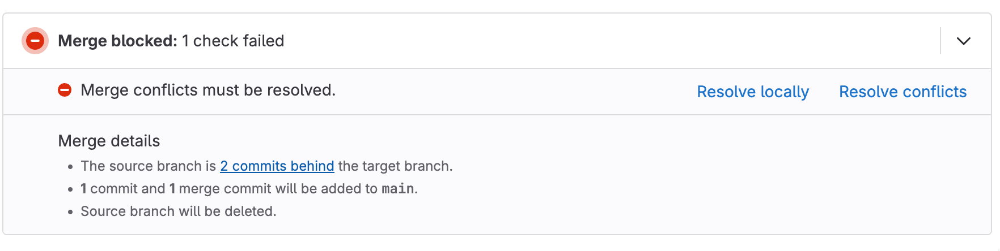

# Merge Request

## 前提

git CLIでやってみましょう。

Git GUIの動作の理解にもつながるはずです。

## 0. Gitエイリアスの設定

```bash
$ vi ~/.gitconfig
# 以下を追加
[alias]
    s = status
    c = commit
    a = add
    br = branch
    sw = switch
```

[Git \- Git エイリアス](https://git-scm.com/book/ja/v2/Git-%E3%81%AE%E5%9F%BA%E6%9C%AC-Git-%E3%82%A8%E3%82%A4%E3%83%AA%E3%82%A2%E3%82%B9)

## 1. Merge Requestの作成(新規ファイル追加)

### お題

sandboxリポジトリに自分の名前のファイルを追加してください。

ファイルの中身は好きな食べ物を記載してください。

変更内容はmainブランチに向けて、Merge Requestで作成してください。

例)

- ブランチ名: taro_git
- ファイル名: taro_git.txt
- ファイル内容: sushi

※「taro_git」は自分の名前に置き換えてください

### 手順

1. 「sandbox」リポジトリをClone。(clone)
2. ブランチを作成(switch)
    1. ブランチ名は自分の名前
    2. 例) taro_git
3. ファイル名を作成。
    1. ファイル名: 自分の名前
        1. 例) taro_git
    2. ファイルの中身: 好きな食べ物
        1. 例) sushi
4. ローカルリポジトリに作業内容を保存(add, commit)
5. リモートリポジトリにローカルリポジトリの変更を反映(push)
    1. リモートリポジトリのブランチが作成または更新される
6. Merge Requestをmainブランチに作成

### ハンズオン

```bash
# 1.「sandbox」リポジトリをClone。(clone)
git clone <GitLab repo URL>
cd sandbox

# 2.自分の名前で、ブランチを作成(switch)
git branch # 「main」が選択さている
git switch -c taro_git
git branch # 「taro_git」に切り替わっている

# 3.自分の名前のファイル名を作成。ファイルの中身は「好きな食べ物」。
echo "sushi" > taro_git.txt

# 4. ローカルリポジトリに追加(add, commit)
git status # 追跡されていないファイル「taro_git.txt」
git add taro_git.txt
git status # 新規ファイル「taro_git.txt」
git commit -m "add: taro file"

# 5. リモートリポジトリにローカルリポジトリの変更を反映(push)
git push origin HEAD # git push origin taro_gitと同義
# HEADは現在のブランチを指す
```

### 補足: originとは？

**`origin`** は、Gitにおけるリモートリポジトリの標準的な名前（エイリアス）です。

以下の用に、クローンしたソースのリモートリポジトリがoriginに設定されています。

```bash
$ git remote -v # リモートリポジトリの一覧表示
origin  <GitLabレポURL> (fetch)
origin  <GitLabレポURL> (push)
```

上記の`git push origin HEAD`は以下と同義です。

```bash
$ git push <GitLabレポURL> HEAD
# HEADも使わないパターン
$ git push <GitLabレポURL> git_taro
```

## 2. Merge Requestの作成(既存ファイルの変更)

! 当日作業: today_lunch.txtをMRを用意しておいて、「2.」を始めるタイミングでMergeする
! 講師役は「3.」のために、作業を繰り返して2つMR(マージ用・コンフリクト対応用)を用意する。この際、ファイルの変更内容は別とする。

```text
$ cat today_lunch.txt
taro_git,curry
```

### お題

「today_lunch.txt」に今日の昼食を記載してください。

変更内容はmainブランチに向けて、Merge Requestで作成してください。

例)

- ブランチ名: taro_git_lunch
- 変更ファイル名: lunch.txt
- ファイル内容: taro_git,curry

### 手順

1. mainブランチの変更を取り込む。(switch,pull)
2. ブランチを作成(switch)
3. ファイルを変更
4. ローカルリポジトリに作業内容を保存(add, commit)
5. リモートリポジトリにローカルリポジトリの変更を反映(push)
6. Merge Requestをmainブランチに作成

### ハンズオン

```bash
# 1.mainブランチの変更を取り込む。(switch,pull)
git switch main
git pull origin

# 以降は復習がてら手順無し。
# (必要に応じて、「Merge Requestの作成(初期作成)」を確認ください)

git diff # ファイル変更時実施・　変更差分を確認できる
```

## 3. コンフリクトの解消

参加者全員で同じファイルの同じ行を変更したため、Gitはどちらの変更を採用すべきか判断できずコンフリクトが発生しました。

解決するには、作業ブランチ(名前_lunch)をメインブランチ(main)と同期する必要があります。

### 手順

1. ローカルのmainブランチを最新化する(switch,pull)
2. 作業ブランチにmainブランチの変更を取り込む(switch,merge)
3. 競合を解決する
4. ローカルリポジトリに作業内容を保存(add,commit)
5. リモートリポジトリにローカルリポジトリの変更を反映(push)
6. Merge Requestを確認

### ハンズオン



```bash
# 1. ローカルのmainブランチを最新化する(switch,pull)
git switch main
git pull origin

# 2. 作業ブランチにmainブランチの変更を取り込む(switch,merge)
git switch taro_git_lunch
git merge main

# 以降は復習がてら手順無し。
# (必要に応じて、「Merge Requestの作成(初期作成)」を確認ください)
```
